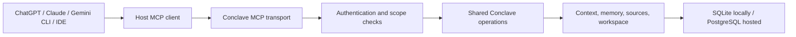

# Conclave MCP and cross-platform connector plan

Researched 2026-10-07. Status: proposal; no MCP server, connector, deployment, or directory submission has been implemented by this work. Repository inspected at `43beaef2f860cde1447e50180a44e0bbb5a0d173` on `dev/decisions-reasoning`.

Build one Conclave MCP service that supplies persistent, source-linked context and memory to external AI applications. Package it for ChatGPT, Claude, Gemini CLI, and other MCP clients. Keep context selection, provenance, corrections, and storage in Conclave; keep platform packaging and usage instructions small.

The first useful demonstration is: save a project decision in Conclave, retrieve it from ChatGPT, continue the project in Claude, and recover the same decision and its original source in Gemini CLI. Every client signs into the same Conclave account and explicitly selects the same scope.

## How MCP works

The AI application is the **host**. Its **MCP client** talks to an external **MCP server**, which advertises callable tools, readable resources, and reusable prompts. MCP standardizes JSON-RPC messages, discovery, schemas, results, and transports. Local servers can use stdio; remote servers use Streamable HTTP. Resources and prompts are useful additions, but a portable initial product should work through tools alone. [Official architecture](https://modelcontextprotocol.io/docs/2026-07-28/learn/architecture)



The host chooses when to call tools and what returned material enters its model input. **MCP does not by itself provide a complete host transcript, rewrite the host's context window, or guarantee a call on every turn.** Conclave's existing control of complete model requests remains available in Converse and Conclave-controlled agents. External connectors provide context and recovery on demand. Automated capture requires a separately supported host integration or an explicit import workflow. This is an architectural limit inferred from the documented host/server boundary.

### Protocol compatibility is a first-class task

The current published revision is `2026-07-28`: it uses stateless requests and `server/discover`, replacing the earlier initialization handshake and protocol sessions. The official TypeScript SDK identifies v2 (`@modelcontextprotocol/server`) as its stable implementation, with v1 (`@modelcontextprotocol/sdk`) maintained separately. ChatGPT's custom-server guide still mentions initialization. Documentation alone therefore does not establish one version supported by every target. [MCP changes](https://modelcontextprotocol.io/specification/2026-07-28/changelog), [official SDK](https://github.com/modelcontextprotocol/typescript-sdk), [ChatGPT guide](https://developers.openai.com/api/docs/guides/custom-mcp-server)

Use official SDKs and pin tested releases. Target the current protocol and test earlier client behavior, starting with `2025-11-25`. If the SDK does not supply the needed compatibility, keep version-specific adapters behind one operations layer, with explicit endpoint/configuration selection. Do not write a custom protocol stack or infer a protocol version from a brand name. Record actual client version, discovery/initialization behavior, transport, and supported features before choosing the release configuration.

## What already exists and what must change

Verified by reading the current checkout, rather than relying on earlier rollout status:

| Existing building block | Reuse | Required addition or boundary |
|---|---|---|
| [`ConclaveService`](../../../src/service.js), [`index.js`](../../../src/index.js) | Transport-independent service and library exports | Purpose-built bounded connector operations; no wholesale exposure of internal methods |
| [`Harness`](../../../src/harness.js), [`memory-controller.js`](../../../src/memory-controller.js), [`memory-tools.js`](../../../src/memory-tools.js) | History search, exact retrieval, memory selection, revision guards | Extract reusable safe read operations; avoid general internal tool dispatch |
| [`Store`](../../../src/store.js), [`ContextRepository`](../../../src/context-repository.js) | SQLite/PostgreSQL events, snapshots, owner filtering and fenced mutations | Require a verified owner for every remote request and bind explicit scopes to grants |
| [`hosted.js`](../../../src/hosted.js), [`http.js`](../../../src/http.js), [`access.js`](../../../src/access.js) | Current browser API and scoped repository construction | Separate MCP bearer-token authentication; browser cookies/origin policy are not the connector auth contract |
| [`credentials.js`](../../../src/credentials.js) | Account-scoped provider keys for optional paid operations | Keep keys out of tool arguments/results and disable implicit environment-key spending |
| Versioned workspace, memory corrections, suppression and exports | Existing lifecycle and audit mechanics | Connector proposals cannot be passed into APIs that record edits as direct human actions |
| [`sync-converse.js`](../../../scripts/sync-converse.js) | Source-first migration with hashes and dependency checks | Account for new SDK/runtime entrypoints: the script currently migrates almost all `src` files |

No MCP dependency or MCP server entrypoint was found in the inspected engine. Existing memory and semantic retrieval are conversation-local. Project-wide sharing across arbitrary conversations and portable import/restore remain planned work in [project context](../../../PROJECT_CONTEXT.md).

For the MVP, one selected Conclave conversation is one **project scope**. Reuse its real `conv_...` identifier. A directory/configuration label can present it as a project without introducing an unimplemented global memory layer. Allow users to opt specific existing conversations into connector access. Add multi-conversation project aggregation later, with explicit membership, conflict resolution, and provenance.

## Recommended product boundary

Ship two runtime forms with the same operations and schemas:

1. **Remote service:** authenticated HTTPS Streamable HTTP endpoint, backed by the existing owner-scoped PostgreSQL repository. This is the primary cross-platform offering.
2. **Local package:** stdio process backed by SQLite for local MCP clients. It uses a dedicated data directory and explicit scope configuration. A local package must not accidentally inherit all deployment credentials.

The remote deployment may live beside Converse, but its MCP authentication, transport, and responses stay separate from `/api/conclave`. Extract a reusable authenticated operations factory from `hosted.js`; pass it a verified principal, scopes, selected conversation grant, and an explicit credential policy. Refuse missing identity before constructing `ContextRepository`: its current `owner: null` behavior permits unscoped access.

Do not bind project choice to a process-wide variable or a transport session. Carry a server-validated scope identifier on each call. A later context snapshot handle can bind owner, scope, sequence, memory/context revisions, and expiry. It is a consistency handle, never a substitute for authorization.

### Initial tool contract

Names below are proposed public APIs. Read tools return bounded results, source references, revisions, and opaque continuation cursors. They use `readOnlyHint: true`; proposal and write tools use accurate write annotations. Annotations guide clients; the server independently enforces authorization. ChatGPT supports custom read/write tools and does not require `search`/`fetch` for a basic custom MCP plugin. [Official OpenAI documentation](https://developers.openai.com/api/docs/guides/custom-mcp-server)

| Tool | Purpose | Engine implementation work |
|---|---|---|
| `conclave_list_projects` | List connector-enabled scopes belonging to this account | Owner-filtered, paginated metadata; no conversation contents |
| `conclave_get_context` | Return relevant constraints, decisions, unresolved issues, memory pointers and current file references for a query | New projection operation using existing selection/protection logic; explicit output budget and overflow |
| `conclave_search` | Search within the selected scope, with optional source or memory filters | Existing deterministic search first; later opt-in semantic retrieval |
| `conclave_read_source` | Recover an exact source passage with origin and offsets | Safe model-facing retrieval rules; enforce removed/suppressed-source policy, rather than exposing raw `sourceEvent` unchanged |
| `conclave_read_memory` | Inspect a specific record and correction lineage | Existing memory readers with revision-consistent paging |
| `conclave_list_files` | Discover current workspace files and versions | Bounded metadata read |
| `conclave_read_file` | Read a workspace file or bounded section | Version-aware read and cursor |
| `conclave_propose_memory` | Stage a proposed decision, preference, correction, or retirement | New proposal operation; immutable referenced sources; unresolved until trusted approval |

Example intended context request:

```json
{
  "scope_id": "conv_EXAMPLE",
  "query": "What constraints apply to the deployment plan?",
  "max_characters": 12000
}
```

Return a concise text representation plus structured data: scope, read version, complete admitted constraints, decisions, unresolved/conflicting records, source IDs/URIs, retrieval pointers, omitted counts, and any capacity error. Do not silently clip a binding constraint. Token estimates, if supplied later, must identify the tokenizer and coverage; a character allowance is not a promise about the host's token consumption.

Use authenticated source links for human inspection. Optional MCP resource URIs can identify sources/files, but every resource read enforces the same ownership and suppression rules. Keep tools as a fallback for hosts that do not use resources or prompts. Canonical exports and raw model-request traces are excluded from default connector access.

### Capture, correction and authority

An authenticated tool call establishes which account made the request; it does not establish that every word in its arguments came directly from a human. Existing `saveState`, `saveMemory`, `remember`, and approval APIs can append events attributed to a human. Wrapping them directly would give model-generated arguments stronger authority than warranted.

Add an external-input contract before connector writes:

- Preserve submitted bytes, source hash, reported author/role, client identity, import mechanism, timestamp, and any externally supplied message ID. Reported metadata stays visibly unverified unless a trusted mechanism establishes it. Keep an unknown model unknown.
- Store model-mediated text as external source data or unresolved proposals. Never let an `actor: human` argument create human authority.
- Admit binding commitments/corrections through a trusted Conclave review surface or a separately verified host approval mechanism bound to the exact proposal, target IDs, content hash, revisions, and expiry. Ordinary tool availability or a model's claim of approval is insufficient.
- Import quoted/user/assistant passages separately, retaining full passage boundaries and lineage. Source documents cannot issue memory-control commands.
- Require expected revisions and durable idempotency keys for mutations. Repeating a key with different bytes must fail. Protect suppression and correction against concurrent edits.
- Give users remember, review, correct, suppress/restore, scope selection, and disconnect controls. Suppression is reversible availability control; it is not permanent erasure of append-only sources or previously shared copies.

The default connector runs no task-model answer, embedding call, selector call, or compaction. Read requests reuse stored data and deterministic selection. Optional paid enrichment is a later explicit setting using account-scoped keys and visible usage. Conclave does not need a Gemini task-provider adapter merely to be used by a Gemini host. A Gemini adapter is a separate feature if Conclave itself will run Gemini inference.

## Platform delivery plan

| Platform | Documented connection route | Conclave package and acceptance check |
|---|---|---|
| ChatGPT | Custom MCP plugin with remote Streamable HTTP; OAuth available | First test a private custom server. Then ship an Agent Plugins package with `plugin.json`, MCP configuration, and a small context workflow skill. Verify account linking, scope selection, source recovery, and write confirmation. [Custom-server guide](https://developers.openai.com/api/docs/guides/custom-mcp-server), [packaging/submission](https://developers.openai.com/plugins/deploy/submission) |
| Claude | Remote custom connector; plugin bundles can combine MCP and skills | Connect the same hosted service privately, then prepare a plugin/repository for the directory. A separate `.mcpb` desktop bundle can distribute the local stdio runtime. Test remote and local routes separately. [Remote connectors](https://support.claude.com/en/articles/11175166-get-started-with-custom-connectors-using-remote-mcp), [plugin submission](https://claude.com/resources/articles/build-plugins-for-claude), [desktop packaging](https://support.claude.com/en/articles/10949351-getting-started-with-local-mcp-servers-on-claude-desktop) |
| Gemini CLI | MCP server configuration and installable extensions | Package `gemini-extension.json`, `GEMINI.md`, and optional recall/checkpoint commands, pointing to remote or local Conclave. Declare requested configuration/secret environment fields. [MCP support](https://geminicli.com/docs/tools/mcp-server/), [extension format](https://geminicli.com/docs/extensions/reference/) |
| Gemini API | Interactions API remote MCP support | Provide a small example with `name: "conclave"`, authenticated headers, and an allowed-tool list. Google documents Streamable HTTP support, excludes legacy SSE servers, and disallows hyphens in server names. Verify the exact target model/API and auth behavior during integration. [Google API documentation](https://ai.google.dev/gemini-api/docs/function-calling#remote-mcp-model-context-protocol) |
| Consumer Gemini chat app | A general custom MCP connector installation route was not established by this research | Track as an open availability question. Do not advertise the CLI or API integration as consumer-app support. Recheck official Google documentation before committing to this surface. |
| Codex, VS Code/Copilot, Cursor and other clients | Standard MCP configuration, with client-specific config formats/features | Publish tested configuration examples against the same server. Add richer extensions only for a demonstrated need. [OpenAI plugin authentication](https://developers.openai.com/plugins/build/auth), [VS Code](https://code.visualstudio.com/docs/agent-customization/mcp-servers), [Cursor](https://prod.cursor.com/help/customization/mcp) |

Platform instructions should teach a short workflow: select project, get context before substantial work, read original sources when a pointer or uncertainty matters, and propose a checkpoint when requested. Instructions improve tool use; they do not guarantee automatic synchronization. A hosted MCP endpoint is sufficient for the core integration; embedded UI is optional later work.

Directory distribution is a separate release step. OpenAI's current submission process includes review materials and test cases; Claude also reviews directory submissions. Prepare publisher identity, privacy/support information, test accounts, demonstrations, and data-access explanations after private connector behavior passes. Directory acceptance and account eligibility must be verified, never assumed. [OpenAI submission](https://developers.openai.com/plugins/deploy/submission), [Claude submission](https://claude.com/resources/articles/build-plugins-for-claude)

## Remote authentication and access

Use OAuth authorization-code + PKCE with discovery metadata and audience-bound bearer tokens. Publish protected-resource metadata and authorization-server metadata, and return the appropriate authentication challenge. Prefer CIMD or predefined client registration where supported; retain DCR only when tested clients require it. Evaluate the existing identity provider for these capabilities; existing website login alone does not establish MCP authorization-server support. [MCP authorization](https://modelcontextprotocol.io/specification/2026-07-28/basic/authorization), [OpenAI authentication requirements](https://developers.openai.com/plugins/build/auth)

Proposed scopes: `conclave:read`, `conclave:propose`, `conclave:workspace-write`, and a later separately granted `conclave:run`. Enforce account ownership plus per-project grants on every tool/resource call; a broad read scope must not expose every conversation by default. Validate issuer, audience, expiry, scopes and grant revocation. Reject null-owner remote execution. Recheck permissions on every continuation; expire outstanding handles after revocation. Disable shared caches for private results and use version-appropriate private cache metadata.

Support a managed short-lived bearer credential for controlled API examples where a client does not perform interactive OAuth. It must represent a specific Conclave account and grant, never an upstream model API key. Keep OAuth credentials, Conclave access tokens, and provider inference keys separate. Validate any remotely fetched OAuth client metadata URLs using suitable network restrictions. Record tool/operation outcomes and references without logging tokens or complete private payloads.

Keep the current browser same-origin guard intact. Implement the MCP route's own transport-appropriate Origin/DNS-rebinding checks and token validation; do not disable browser protection to accommodate remote clients. Apply bounded requests/results, per-account rate limits, and strict tool allowlists. Published remote connectors must be reachable from the clients' cloud infrastructure; localhost is not their remote service. [Claude network requirements](https://support.claude.com/en/articles/11175166-get-started-with-custom-connectors-using-remote-mcp)

## Sequenced build checklist

### 0. Freeze the public contract and verify clients

- [ ] Create a dedicated MCP development branch from an intentionally selected engine baseline; do not couple this feature to experimental Auto reasoning merely because that is today's checkout.
- [ ] Record supported client surfaces, versions, transports, auth flows, and protocol revisions using a minimal fixture server and harmless test data.
- [ ] Pin the official SDK release(s), decide current/legacy adapter support, and design connector-visible grants, revisions, cursor shape, errors, and tool schemas.
- [ ] Decide remote versus local package boundaries. Prefer a separate MCP package/entrypoint under `packages/conclave-mcp/` so the current recursive engine migration does not copy a CLI launcher or SDK dependency into Converse unintentionally.

**Exit:** documented client matrix and schema examples; no claim of compatibility based solely on an Inspector test.

### 1. Implement bounded reads and a local stdio server

- [ ] Add shared connector read operations in Conclave, enforcing safe source eligibility, provenance, suppression, file versions, and complete-constraint admission.
- [ ] Implement the seven read tools using the chosen SDK. Restrict stdio stdout to protocol traffic and send diagnostics to stderr.
- [ ] Add explicit scope selection and local read-only configuration; reject writes and incidental inference.
- [ ] Validate from an MCP test client and at least one real local host.

**Exit:** after restart, the host retrieves a saved decision and exact source; suppressed/removed sources stay unavailable; reads make zero provider calls.

### 2. Implement authenticated remote HTTP and ChatGPT/Claude pilots

- [ ] Extract the scoped operations factory and implement verified-principal/grant resolution.
- [ ] Add OAuth discovery/linking, read scope, revocation, and the MCP HTTP transport. Start with bounded request/response operations; add streaming only where needed.
- [ ] Stage behind isolated grants and disposable conversations; validate cloud reachability and the actual hosting runtime's headers, streaming, cold starts, and request lifetime.
- [ ] Connect private ChatGPT and Claude installations and repeat the local source-recovery scenario.

**Exit:** both hosts retrieve the same permitted scope through independent account linking; wrong-account IDs, missing scopes, expired tokens, revoked grants, and forged cursors disclose no data. Disconnecting a grant prevents later access.

### 3. Add proposals, explicit intake and guarded writes

- [ ] Implement external-source intake and memory proposals with truthful role/origin metadata and idempotency. Imported data remains distinct from verified human instructions.
- [ ] Add a trusted review/approval surface in Conclave/Converse; apply exact-content, source and revision checks when promoting or correcting records.
- [ ] Add bounded workspace patch proposals/commits only after full-version readback and authorization. Preserve atomic batch behavior.
- [ ] Return compact mutation receipts instead of full conversation views. Update tool annotations and granted scopes.

**Exit:** a correction approved through a trusted surface supersedes the earlier decision for every client while preserving its lineage. Duplicate requests do not duplicate events, stale revisions cannot overwrite newer state, and injected text cannot authorize suppression.

### 4. Package and test across platforms

- [ ] Produce ChatGPT/OpenAI and Claude plugin bundles, Gemini CLI extension, optional Claude Desktop `.mcpb`, and Codex/VS Code/Cursor config examples.
- [ ] Maintain one shared workflow guide with generated platform wrappers; test actual installation and updates.
- [ ] Run the cross-host handoff demonstration. Add an authenticated Gemini API example separately from the CLI.
- [ ] Give users account/project selection, connection status, revocation, remembered-state inspection, and visible capture limitations.

**Exit:** installation works without hand-editing secrets into source-controlled manifests; each advertised platform passes the same core workflow. Publish a supported/unsupported matrix with dated evidence.

### 5. Release and evaluate

- [ ] Commit/test Conclave first, migrate shared engine operations into Converse, parity-check, then test its application integration. Update the migration script only where package boundaries require it.
- [ ] Deploy the verified endpoint and separately verify deployed behavior; record source commit and deployed build. Treat commit, push, deployment, and directory submission as distinct actions.
- [ ] Prepare directory submissions after private pilots pass. Submit and track only the surfaces actually supported.
- [ ] Measure source recovery, correction fidelity, tool use, missed checkpoints, bytes/tokens delivered, latency, and management overhead on matched tasks.

**Exit:** published installation documentation matches actual release behavior. Savings or quality claims require comparable real workloads and observed usage; reduced response text alone is insufficient.

## Verification scenarios that determine release readiness

| Scenario | Required behavior |
|---|---|
| ChatGPT → Claude → Gemini CLI handoff | Same selected project, current decision, and exact attributed source survive independent sessions and server restart |
| Quoted instruction or hostile imported document | Retrieved text stays data; it cannot grant access, set human authority, or approve a proposal |
| Model says “the user approved” | Approval is rejected without the required trusted content-bound evidence |
| Two clients correct the same record | First valid revision commits; stale proposal receives a conflict and must reread |
| Retry after connection loss | Same idempotency key produces one durable mutation; a changed payload is rejected |
| Constraint exceeds allowance | Explicit capacity response and recovery path; no silently shortened binding conditions |
| Suppression/removal/revocation | Search, context, direct reads, resources, files where applicable, and cursor continuation enforce the relevant lifecycle/access rule |
| Wrong account guesses a conversation/source ID | No source content, metadata, or cached response is disclosed |
| A host omits checkpoint calls | Conclave reports the last captured scope/version; the product does not claim to have captured missing turns |
| Older/current MCP clients | Independently verified discovery/handshake, schemas, results, headers, private caching, and error behavior |
| Read-only pilot without provider keys | Core retrieval works, and instrumentation confirms zero model/embedding/selector calls |

Later increments can add resource/prompt conveniences, embedded context/memory UI, multi-conversation projects, selective automatic capture through verified host hooks, and bounded background tasks. Exposing `ask` or Agent start/step/stop is a separate opt-in feature with explicit spend limits, credential policy, durable execution, cancellation, and polling fallback. Do not require host sampling or optional task extensions for the core connector.

**Recommended first implementation:** bounded connector reads + local stdio, followed immediately by owner-scoped remote HTTP/OAuth and private ChatGPT/Claude pilots. That tests the useful product boundary before investing in publication packaging or automatic capture.
